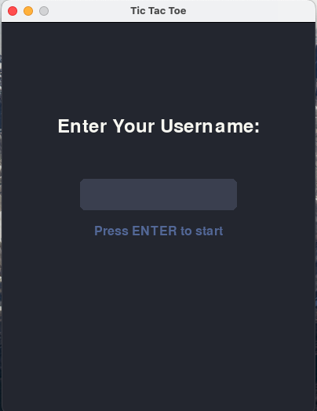
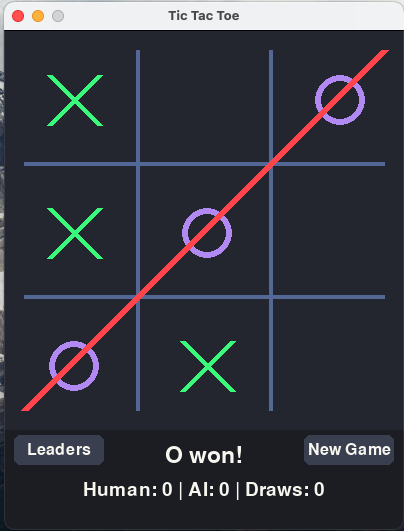

# TicTacBot

A modern Tic Tac Toe game built with Pygame, featuring an unbeatable AI opponent and a persistent leaderboard. The game uses the Dracula theme for a sleek, modern look.

## Features
- Clean, modern UI with Dracula theme
- Unbeatable AI using the Minimax algorithm
- Persistent leaderboard tracking top players
- Username system
- Game statistics tracking
- Modern button design and hover effects

## Screenshots

 
*Showing the app start screen*

 
*Main game interface with Dracula theme*

## Requirements
- Python 3.6+
- Pygame 2.5.2

## Installation

1. Clone the repository: 

```bash
git clone https://github.com/subaashnair/TicTacBot.git
```

2. Install dependencies:

```bash
pip install -r requirements.txt
```

3. Run the game:

```bash
python tic_tac.py
```

## Game Controls
- Click on the "New Game" button to start a new game
- Click on the "Leaders" button to view the leaderboard
- Click on the "Exit" button to quit the game

## Game Rules

    The game is played on a 3x3 grid. The player and the AI take turns marking the spaces in the grid. The player can mark the spaces with an 'X' and the AI can mark the spaces with a 'O'. The player wins if they can mark three spaces in a row, column, or diagonal. The AI wins if the player cannot win in the next move.

## Leaderboard

The leaderboard displays the top 10 players based on the number of games won. The leaderboard is persistent and will save the data to a file.

## Game Statistics

The game statistics display the number of games played, the number of games won by the player, and the number of games won by the AI. The statistics are persistent and will save the data to a file.

## Game Theme

The game uses the Dracula theme for a sleek, modern look.       